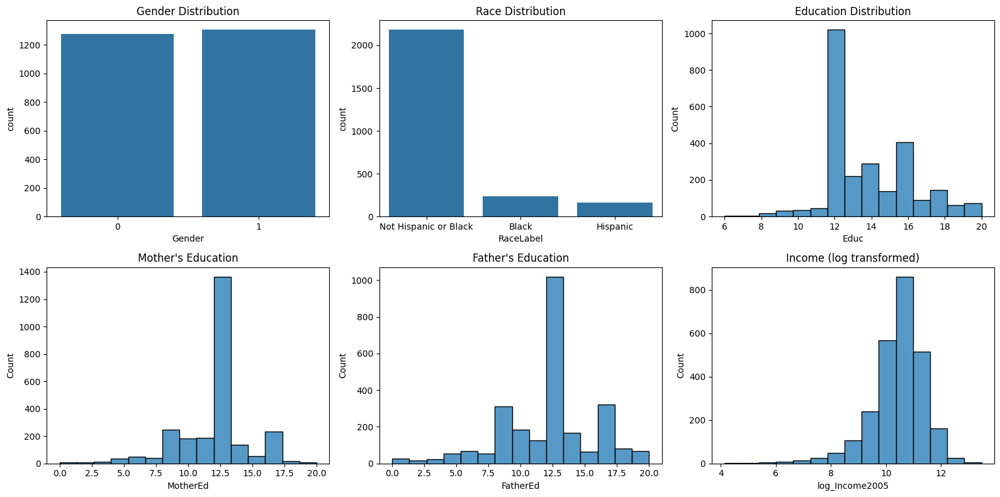
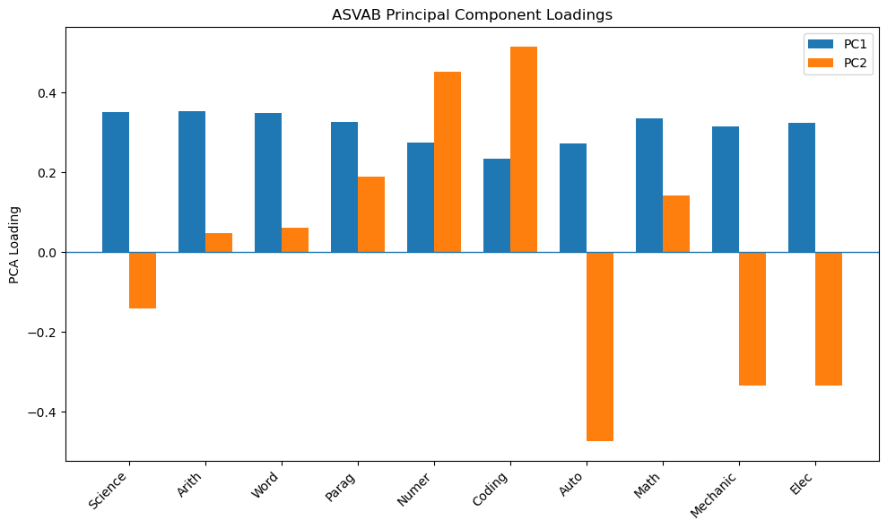
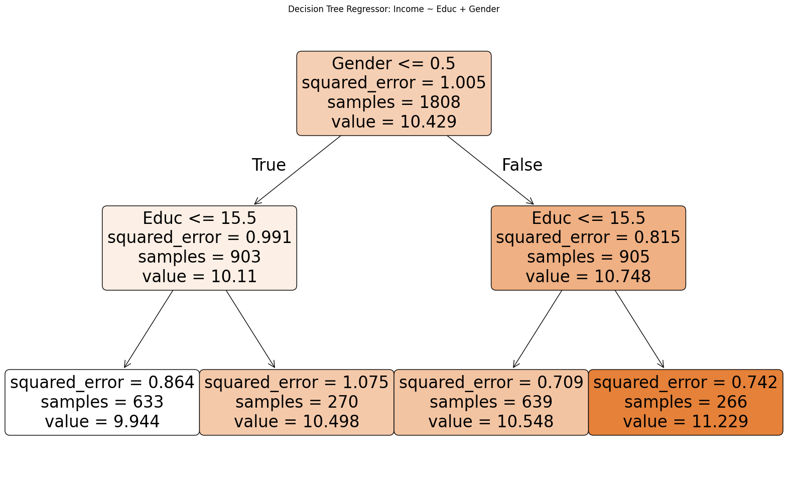
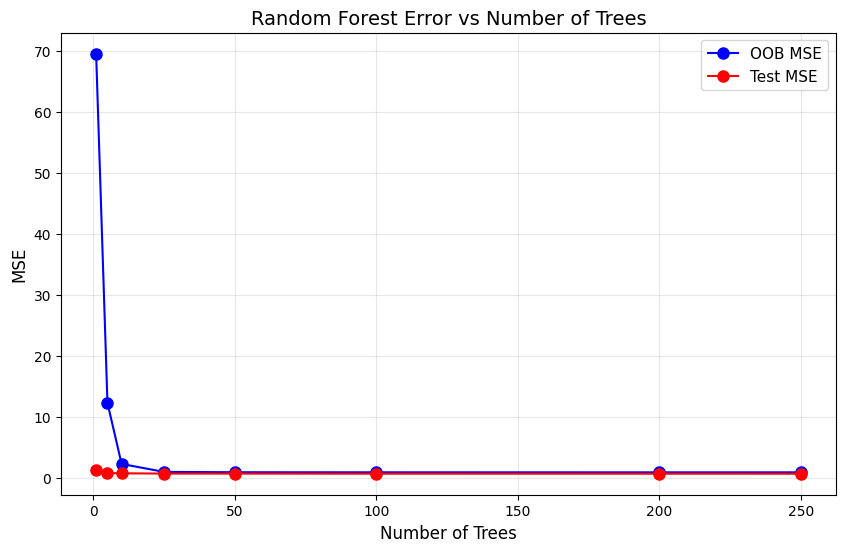
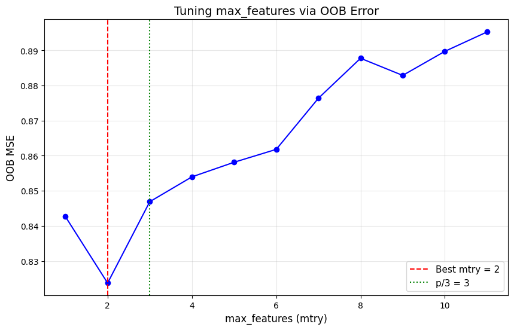
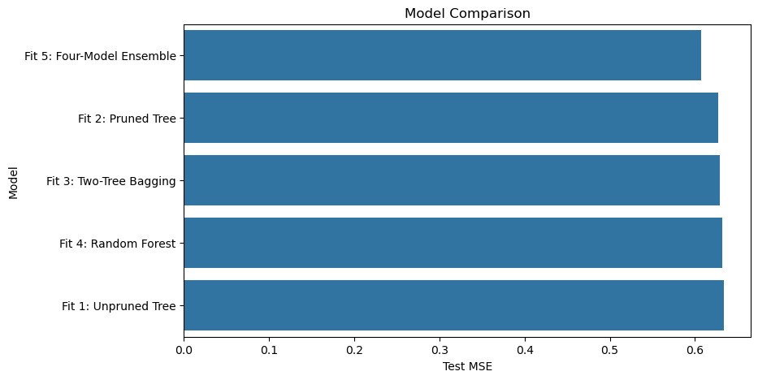

# Figures

This folder contains the main visualizations used to summarize the statistical and machine-learning analyses in the NLSY79 income prediction project.

## Files

### `eda_distributions.png`

Shows the distributions of selected demographic and socioeconomic variables, including gender, race, education, parental education, and log-transformed 2005 income.

The log transformation substantially reduced the strong right skew in income, making the outcome more suitable for linear modeling. 

---

### `pca_loadings.png`

Displays the loadings of the ten ASVAB subtests on the first two principal components.

- **PC1** has positive loadings across all ten subtests and represents broad overall ASVAB performance.
- **PC2** contrasts numerical, coding, and verbal skills with more technical and mechanical skills.

PC1 explains approximately **61% of the total variance** in the ASVAB measures. :contentReference[oaicite:1]{index=1}

---

### `pruned_decision_tree.png`

Shows the pruned decision tree model using gender and education to predict log-transformed income.

Pruning reduced unnecessary model complexity and slightly improved test performance compared with the fully grown decision tree. :contentReference[oaicite:2]{index=2}

---

### `random_forest_n_estimators.png`

Shows random forest performance as the number of trees increases.

The out-of-bag error decreased substantially with the first several trees and then stabilized, indicating that additional trees provided limited improvement after the model had largely converged. :contentReference[oaicite:3]{index=3}

---

### `random_forest_max_features.png`

Shows the effect of the `max_features` hyperparameter on out-of-bag error.

The analysis selected the value that minimized OOB error, balancing tree diversity and individual tree strength. :contentReference[oaicite:4]{index=4}

---

### `model_comparison.png`

Compares the test mean squared error across the five predictive approaches evaluated in the project:

- Fit 1: Unpruned Decision Tree
- Fit 2: Pruned Decision Tree
- Fit 3: Two-Tree Bagging
- Fit 4: Random Forest
- Fit 5: Four-Model Ensemble

The final ensemble achieved the lowest test MSE, approximately **0.6093**, and was selected as the best-performing predictive model. :contentReference[oaicite:5]{index=5}
